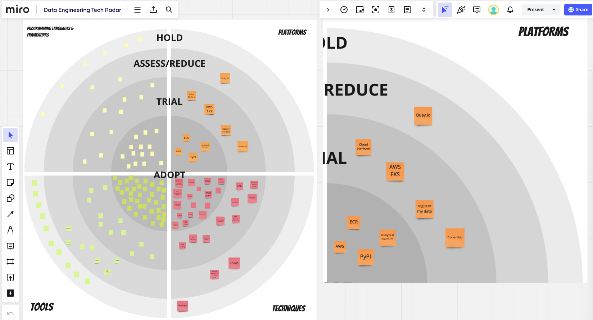

<!-- _header:  -->

# [Centre for Excellence](https://github.com/moj-analytical-services/dmet-cfe)

## Data and Analytics Engineering

##### June 2024

---

## Mission Statement

Our mission is to drive excellence and innovation in data and analytics engineering through continuous improvement, collaboration, and knowledge sharing. 

We set the technical direction, prioritising addressing immediate challenges faced by domain teams and their partners.

---
<!-- _class: columns -->

## Why a Centre for Excellence?

##### :repeat: Lack of Standardization

###### Challenge

Inconsistent processes and methodologies across different teams can lead to inefficiencies and quality issues.

######  Solution

The CfE establishes and promotes standardized best practices and procedures to ensure consistency and quality.

##### :hourglass_flowing_sand: Inefficiency

###### Challenge

Redundant processes and inefficiencies can waste resources and slow down project delivery.

###### Solution

The CfE identifies and eliminates inefficiencies, streamlines processes, and implements best practices to improve overall efficiency.

##### :chart_with_downwards_trend: Inadequate Reporting

###### Challenge

Without tools and process to measure performance it can be difficult to assess progress and identify areas for improvement.

###### Solution

The CfE develops processes to track progress, measure success, and identify opportunities for improvement.

---

# What have we achieved so far?

---
<!-- _class: columns -->

### Improved data processing

###### Challenge

Cost and time taken to curate data was increasing exponentially. Different teams were using different tools to do the same thing.

###### Action

Collaborated with HMPPS data engineering, and then expanded to HMCTS, to implement innovative solutions.

###### Impact

We are saving 380K per year on data processing and refreshing data more frequently with less failures.

###### Knowledge Sharing

Wrote AWS Blog and presented at x-gov data engineering.

### Leveraged GitHub ecosystem

###### Challenge

We use GitHub for source code management but different tools for documentation and project management.

###### Action

Investigated other tools in GitHub ecosystem and consulted with GitHub experts in MoJ.

###### Impact

We are making more effective use of the GitHub ecosystem.
We have a central location to track deliverables across Data and Analytics  Engineering.

###### Knowledge Sharing

Wrote Blog in Handbook and presented at Analysis in Gov.

---
<!-- _class: removeBoxShadow -->
<!-- _color: black -->

# What next?

---
<!-- _footer: '' -->
<!-- _class: removeBoxShadow -->

---
<!-- Tech radar SVG do not modify!-->

<iframe class="scaled-iframe" src="https://moj-analytical-services.github.io/data-and-analytics-engineering-tech-radar/index.html" frameborder=1 ></iframe>

---
<!-- _class: columns -->

## Why a Tech Radar?

### Lack of Standardization :repeat:

A Tech Radar identifies and promotes the adoption of standardized technologies and practices. By providing a clear view of the recommended and deprecated technologies, we can ensure more consistent implementation.

### Skill Gaps :books: 

The Tech Radar highlights emerging technologies and skills that are becoming important. This allows the CfE to focus training and development efforts on the most relevant areas, helping to bridge skill gaps.

### Siloed Knowledge :lock_with_ink_pen: 

By regularly updating the Tech Radar and involving different teams in its creation, the CfE fosters cross-team collaboration and knowledge sharing. It serves as a centralized resource that all teams can refer to, reducing silos.

### Inefficiency & Redundancy :hourglass_flowing_sand:

The Tech Radar helps in identifying redundant technologies and processes. By phasing out outdated or duplicate tools, the CfE can streamline operations and improve efficiency.

### :repeat: Lack of Innovation

The Tech Radar keeps the organization aware of cutting-edge technologies and encourages experimentation. This proactive approach to monitoring technological trends drives innovation and keeps the organization competitive.

### :repeat: Resource Constrains

The Tech Radar helps prioritize technology investments by clearly indicating the status of technologies. This ensures optimal allocation of resources to the most impactful technologies.

---

###### Icon Attributions

<a href="https://www.flaticon.com/free-icons/bullseye" title="bullseye icons">Bullseye icons created by Design Circle - Flaticon</a>
<a href="https://www.flaticon.com/free-icons/achievement" title="achievement icons">Achievement icons created by Freepik - Flaticon</a>
<a href="https://www.flaticon.com/free-icons/road-map" title="road map icons">Road map icons created by Prosymbols Premium - Flaticon</a>
