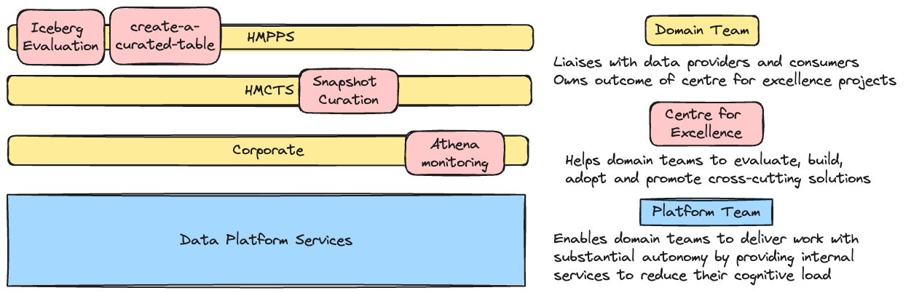

# [DMET Enablement Team](https://github.com/moj-analytical-services/dmet-coe)

## [MoJ Analytical Platform](https://user-guidance.analytical-platform.service.justice.gov.uk/#content)

---

# What is the Enablement Team?

Formed within the Data Modelling and Engineering team to help domain teams evaluate, build, adopt and promote strategic solutions.

- :sos: We are need-driven: The work we do will answer specific problems our domain teams and their partners face.

- :hourglass_flowing_sand: We have a rotational membership: The enablement team will collaborate with the relevant domain team(s) for the duration of the project.

- :busts_in_silhouette: We cross team boundaries: Where problems impact or require a cross-cutting solution we will consult across domains and professions.

---

# Modes of Interaction

