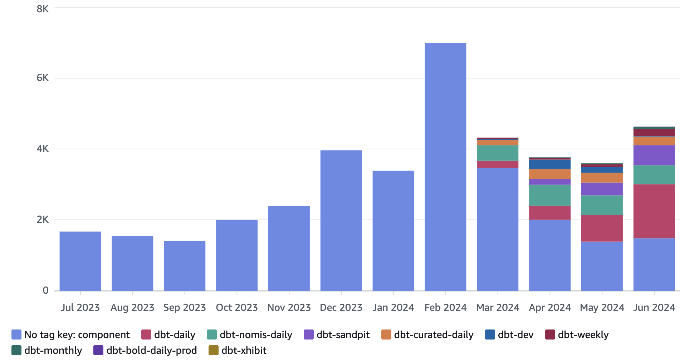

<!-- _header:  -->

# [Monitoring Athena and Data Access](https://moj-analytical-services.github.io/dmet-cfe/athena_monitoring/)

## [](https://github.com/moj-analytical-services/dmet-cfe/tree/main/investigations/athena_monitoring/) Centre for Excellence

##### July 2024 

---

## Why monitor Athena?



---
<!-- _class: removeBoxShadow -->


---

## Overview

0. ### Why monitor Athena?
2. ### Out-of-Scope
3. ### Amazon CloudWatch
4. ### AWS CloudTrail
5. ### Amazon Managed Grafana
6. ### (Proposed) Solution Architecture
7. ### Next Steps

---

## Out of Scope (for now)

- ### Incident response :arrow_right: Application Monitoring

- ### Data Quality Metrics :arrow_right: Data Catalogue 

- ### `create-a-derived-table` model metrics

- ### `create-a-pipeline` non-athena metrics

- ### `airflow` non-athena metrics :arrow_right: Analytical Platform

- ### NLP of Athena queries :arrow_right: :question:

---
<!-- _class: removeBoxShadow -->
<style scoped>
section {
  justify-content: flex-end;
}
</style>

## [Amazon CloudWatch](https://docs.aws.amazon.com/AmazonCloudWatch/latest/monitoring/cloudwatch_architecture.html)

### What is happening on AWS?


---
<!-- _class: title -->

# CloudWatch Demo

### Monitoring Athena Workgroups using CloudWatch Metrics

---
<!-- _class: removeBoxShadow -->

## [AWS CloudTrail](https://docs.aws.amazon.com/awscloudtrail/latest/userguide/cloudtrail-user-guide.html)
#### Who did what on AWS? 


<!--  A web service that records AWS API calls for your account and delivers log files to you. The recorded information includes the identity of the API caller, the time of the API call, the source IP address of the API caller, the request parameters, and the response elements returned by the AWS service. -->

---
<!-- _class: removeBoxShadow -->

<style scoped>
p {
  font-size: 20px;
}
</style>

## Recording / Querying CloudTrail events

###### CloudTrail provides three ways to record and view activity in an AWS account:

<div class="columns">

<div>

##### [Event history](https://docs.aws.amazon.com/awscloudtrail/latest/userguide/view-cloudtrail-events.html)

Automatically enabled by default.

Allows you to view the last 90 days of management events in a Region.

There are no CloudTrail charges for viewing the Event history.

</div>

<div>

##### [CloudTrail Lake](https://docs.aws.amazon.com/awscloudtrail/latest/userguide/cloudtrail-lake.html)

Events are aggregated into event data stores based on criteria.

Can view the last 10 or 7 years of events across regions or accounts.

Events can be queried using [CloudTrail Lake queries](https://docs.aws.amazon.com/awscloudtrail/latest/userguide/cloudtrail-lake-queries.html).

Data stores and queries incur charges. 

</div>

<div>

##### [Trails](https://docs.aws.amazon.com/awscloudtrail/latest/userguide/cloudtrail-create-and-update-a-trail.html)

Stores events in an S3 bucket & optionally to CloudWatch Logs.

Events can be queried using [CloudWatch Logs Insight](https://docs.aws.amazon.com/AmazonCloudWatch/latest/logs/AnalyzingLogData.html) or Athena. 

[Events are flattened](https://docs.aws.amazon.com/AmazonCloudWatch/latest/logs/CWL_QuerySyntax-Parse.html) which can be easier to query using Athena, especially if they contain arrays.

Amazon S3 storage and querying incur  charges.

</div>

</div>

---
<!-- _class: title -->

# CloudTrail Demo

### Monitoring AWS Glue API and Athena API events

---

## Amazon Managed Grafana

- [Grafana](https://grafana.com/) is an open-source analytics platform that helps you query, visualize, alert on, and understand your metrics wherever they are stored.
- [Amazon Managed Grafana](https://aws.amazon.com/grafana/) is a fully managed service for Grafana.
- You can use it with CloudWatch by adding it as a data source.

- This [table](https://docs.aws.amazon.com/prescriptive-guidance/latest/implementing-logging-monitoring-cloudwatch/amg-dashboarding-visualization.html) compares Amazon Managed Grafana vs CloudWatch for dashboarding: 
  - Amazon Managed Grafana integrates with AWS Organizations to enable you to read data from AWS sources such as CloudWatch across all your accounts.
  - Grafana provides a larger collection of visualizations.

---
<!-- _class: title -->

# Grafana Demo

---

<!-- _class: removeBoxShadow -->

## Proposed Athena and Data Monitoring Architecture


---

## Proposed Athena and Data Monitoring Architecture

The architecture is split into three parts:

1. **Monitor data access** using AWS Glue APIs, and aggregate/query using Athena. 
This approach still needs to be evaluated because it relies on the undocumented BatchGetTable API.
2. **Monitor Athena usage at the workgroup level** using CloudWatch metrics.

3. **Monitor Athena usage at the user level** using various Athena APIs, and aggregate using CloudWatch Log.
This approach still needs to be evaluated because of the cost incurred triggering an lambda function every time an Athena query is called. 

---

<!-- _class: columns -->

## Next Steps

<div class="columns">

<div>

#### 2024 Q3

###### More investigations

1. [Deploy workgroups for Airflow](#14)
1. Collaborate with OP discovery
1. Colloborate with AWS on how to monitor data usage

</div>

<div>

#### 2024 Q4

###### Cross-cutting monitoring

1. Set up DMET monitoring working group?
1. Deploy monitoring infrastructure 
1. [Update dashboards](#15)

</div>

<div>

#### 2025 Q1

###### Application monitoring

1. Hand-over Athena and data monitoring to AP?
1. Convert dashboards to code?
1. Build monitoring for applications?

</div>

</div>

---
<!-- _class: title -->

# Appendix

---
## Using Athena workgroups in Airflow 

1. Create `airflow-{folder}` workgroup using [`athena_workgroups.tf`](https://github.com/ministryofjustice/analytical-platform/blob/main/terraform/aws/analytical-platform-data-production/athena/athena-workgroups.tf)

2. Add `mojap-athena-query-dump/{folder}` to S3 `read_write` permissions on Airflow role 

3. Add `"WR_WORKGROUP": "airflow-{folder}"` to the env_vars dictionary that is passed to the Airflow task

4. That's it!

---


---
## Custom CloudWatch Logs

[watchtower](https://github.com/kislyuk/watchtower)  is a lightweight adapter between Python [logging](https://docs.python.org/3/library/logging.html) and CloudWatch Logs

```python
import watchtower, logging
logging.basicConfig(level=logging.INFO)
logger = logging.getLogger(__name__)
logger.addHandler(watchtower.CloudWatchLogHandler(log_group_name="soumaya_test"))
logger.info(dict(table="apple", details={}))
logger.info(dict(table="banana", details={}))
logger.info(dict(table="orange", details={}))
logger.info(dict(table="apple", details={}))
```

CloudWatch Log Insights query `stats count(@timestamp) by table` returns:
```
orange 1
apple 2
banana 1
```
