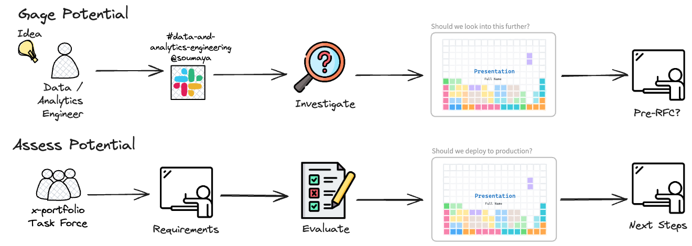
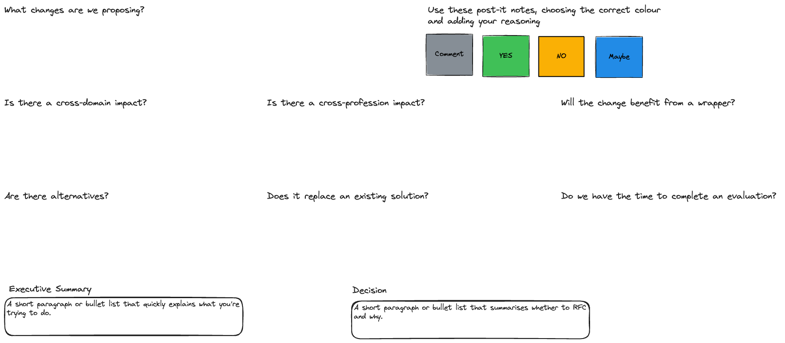
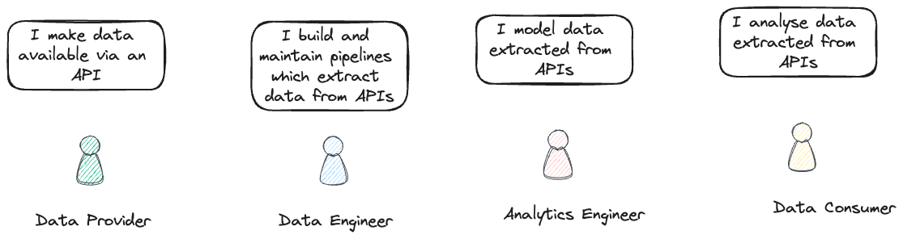
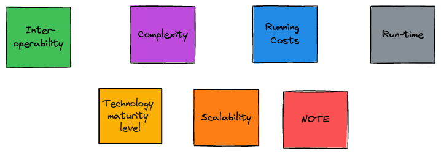
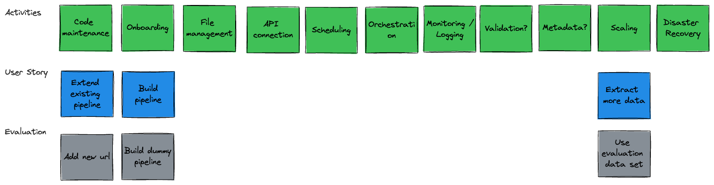

<!-- _header:  -->

# [Evaluation Methodology](https://moj-analytical-services.github.io/dmet-cfe/evaluation_methodology/)

*How we make (significant) changes to our tech stack*

## Centre for Excellence

##### Data and Analytics Engineering

---

## Why formalise tech stack changes?

- Ensures all stakeholders are identified and informed

- Future-proof the solution

- Minimise misalignment & duplication across domains

- Speed up development

- Due diligence

---

## Does  / API Data Extraction need an evaluation?

- Cross-cutting need for extracting data from APIs (as opposed to niche use case)

- APIs are evolving ([REST vs GraphQL](https://aws.amazon.com/compare/the-difference-between-graphql-and-rest/))

- Multiple stakeholders involved (allow analysts to extract data from APIs?)

- Needs to integrate with existing data and analytics engineering tech stack

- Alternatives are available e.g. [Meltano](https://meltano.com/)

- dltHub can be used for more than extracting data from APIs so there is a risk of expansion and duplication

---

## Evaluation methodology

---

## Evaluation methodology

Modified from 2023 [Iceberg Evaluation](https://miro.com/app/board/uXjVMNUs7Pg=/) and [team guide to RFCs](https://leaddev.com/process/thorough-team-guide-rfcs)

#### Investigation

1. Identify enhancement to tech stack
1. Notify Data and Analytics Engineering community and Soumaya
1. Understand capabilities / use-cases
1. Present at Community Forum / Tech Review
1. Complete [pre-RFC](./images/whether_to_rfc.excalidraw.png) template?

####  Evaluation

1. Set up a cross-domain(?) working group
1. Identify [Personas / Users](./images/persona.excalidraw.png)
1. Identify & Prioritise [Evaluation Criteria](./images/evaluation_criteria.excalidraw.png)
1. Create customised [User Story Map](./images/data_engineering_story_map.excalidraw.png)
1. Complete [RFC Template](./rfc_template.md)
1. Complete Evaluation
1. Present at Community Forum / Tech Review

---

## Pre-RFC

---

## Personas / Users

---

## Evaluation Criteria

---

## Data Engineer Story Mapping

---

## Next Steps

There are still lots of open questions:

1. How to ensure proportionality?
1. How to enforce standards without stifling innovation?
1. What is the role of the Centre for Excellence?
1. When to flip from investigation to evaluation?
1. Where to record this information?
1. How do other teams e.g. Data Science deal with x-domain tech changes?
1. How to integrate with other evaluation forums e.g. solution surgery?
