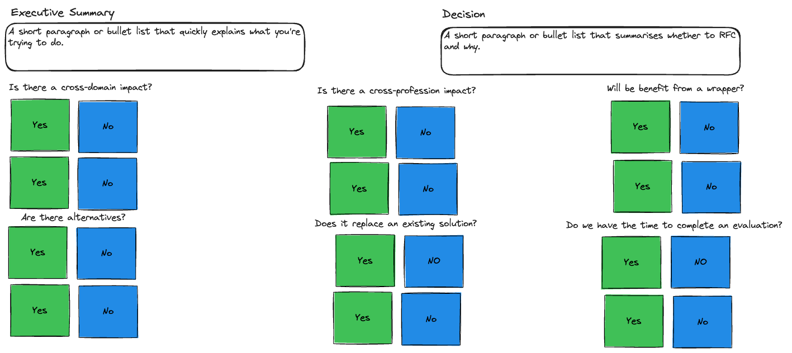
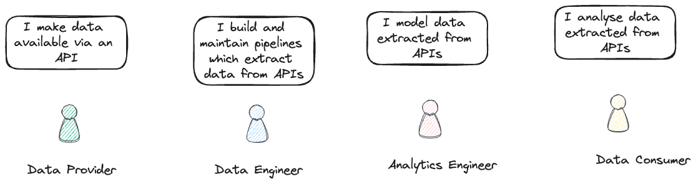
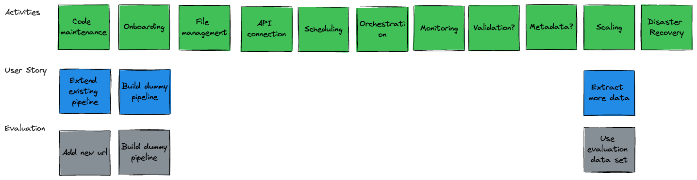

<!-- _header:  -->

# Evaluation Template

## Centre for Excellence

##### Data and Analytics Engineeing

##### July 2024 

---

##  Why follow a Template? 

- Ensures all stakeholders are identified and informed

- Future-proof the solution

- Work around domain barriers

- Minimise duplication

- Speed up development

- Due diligence

---

## Does  / API Data Extraction need an Evaluation?

- Cross-cutting need for extracting data from APIs (as opposed to niche use case)

- APIs are evolving ([REST vs GraphQL](https://aws.amazon.com/compare/the-difference-between-graphql-and-rest/))

- Multiple stakeholders involved (allow analysts to extract data from APIs?)

- Need to integrate with existing data and and analytics engineering tech stack

- Alternatives are available e.g. [Meltano](https://meltano.com/)

- dltHub can be used for more than extracting data from APIs so there is a risk of expansion and duplication

---

## Proposed Approach

Modified from 2023 [Iceberg Evaluation](https://miro.com/app/board/uXjVMNUs7Pg=/) and [RFCs](https://leaddev.com/process/thorough-team-guide-rfcs)

#### Investigation

1. Set up a (cross-domain) working group
1. Understand capabilities / use-cases
1. Complete [whether to RFC](./images/whether_to_rfc.excalidraw.png)
1. Present at Community Forum / Tech Review

####  Evaluation

1. Complete [RFC Template](./rfc_template.md)
1. Optional:
    1. Identify [Personas / Users](./images/persona.excalidraw.png)
    1. Identify & Prioritise [Evaluation Criteria](./images/evaluation_criteria.excalidraw.png)
    1. Create customised [User Story Map](./images/data_engineering_story_map.excalidraw.png)
1. Complete Evaluation
1. Present at Community Forum / Tech Review

---

## Whether to RFC

---

## Personas / Users

---

## Evaluation Criteria

---

## Data Engineer Story Mapping

