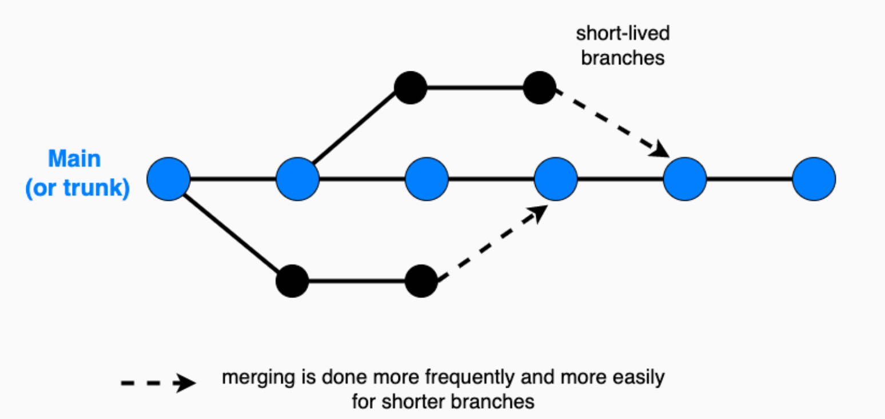

<!-- _header:  -->

## Gitflow vs Trunk Based Development

## Parminder & Tom H

### August 2024

---

## Why?"

-

---

## What? - Long Living Feature Branches

- **Goal** - 

- Feature based development ([GitFlow workflow](https://www.atlassian.com/git/tutorials/comparing-workflows/gitflow-workflow))

- Developers create seperate, long lived branches for individual features.

- Depending on complexity, feature branches can be active for days, weeks or months.

- Once the feature is complete and throroughly tested, it can be merged back into the main branch.

---

## Gitflow Diagram

---

## Benefits of Gitflow

- Isolation of work:
  - Features are developed independently, reducing the risk of conflicts.

- Controlled Integration:
  - Code is reviewed and tested before merging.

- Supports Complex Projects:
  - Easier to manage large, multi-feature projects.

- Flexibility:
  -  Different branching strategies can be adapted to team needs.

---

## Disdvantages of Gitflow

- Complexity
  - Managing multiple branches can become complicated.

- Long Living Branches
  - Feature branches can diverge signifcantly, leading to merge conflicts.

- More Overhead.
  - Time consuming to review PR's and testing.

---

## What is Trunk Based Development?

- **Goal** - perform small incremental updates to minimise merge conflicts, and streamline the dev pipeline.

- Developers collaborate frequently on a single shared branch: "**trunk**" or "**main**".

- Frequent commits to the trunk, often multiple times a day.

- Short-lived branches are allowed, but are merged back to the **main** branch quickly.
 

 
---

## Trunk Based Development Diagram

---

## Benefits of Trunk Based Development

- Continuous Integration (CI)
  - Easier to integrate changes continiously.
  - Promotes frequent and smaller releases.
- Reduced marge conflicts
  - Less branching means fewer conflicts to resolve.
- Faster feedback loops.
  - Immediate feedback on changes.
- Simplified Workflow:
  - No need to manage complex branching structures.
  - Simplified Workflow:
  

---

## Disdvantages of Trunk Based Development

- Requires Discpline
  - Developers must commit to working code frequently.
- Risk of Breaking Changes
  - Changes commited to the trunk can affect all devs.
- Not ideal for Large Teams
  - Scaling can be challenging in large and distributed teams.

---

## Splink - CASE Study

<!-- _class: columns -->

creating columns

other interesting

other interesting

---

## Splink - CASE Study

Some interesting text

---

## Splink - CASE Study

Some interesting text

---

## create-a-pipeline - Linting 

- Refactor all of our linting tools.

- Everyone was on different components, and it was a major change on how we approached linting in the codebase.

---

##  create-a-pipeline - Linting

Some interesting text

---

## create-a-pipeline - Linting

Some interesting text

---

## Best Practices

- TBD
  - Commit often with small incremental changes
  - Use feature toggles to manage incomplete features

- Feature-Based
  - Keep branches short-lived to minimise divergence.
  - Ensure thorough code reviews and testing before merging.
  - Regularly rebase feature branches on the main branch to reduce conflicts.

---

## Strategies from the wild:

- 

- 

---

## Questions?

- What have people done before which has been successful?
- What should be considered a long living branch? (*a few days, weeks? etc.*)
  How long is too long? (*Month? Year?*)
- Other strategies for managing long living branches.

---

## The End

Thanks!

---

## References

List of references:
    
Trunk-Based Development - Atlassian
    
Trunk vs. Feature-Based Development - CircleCI
    
Git Workflow - Atlassian

---