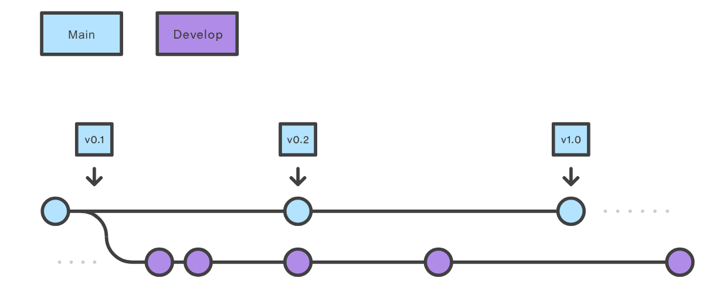
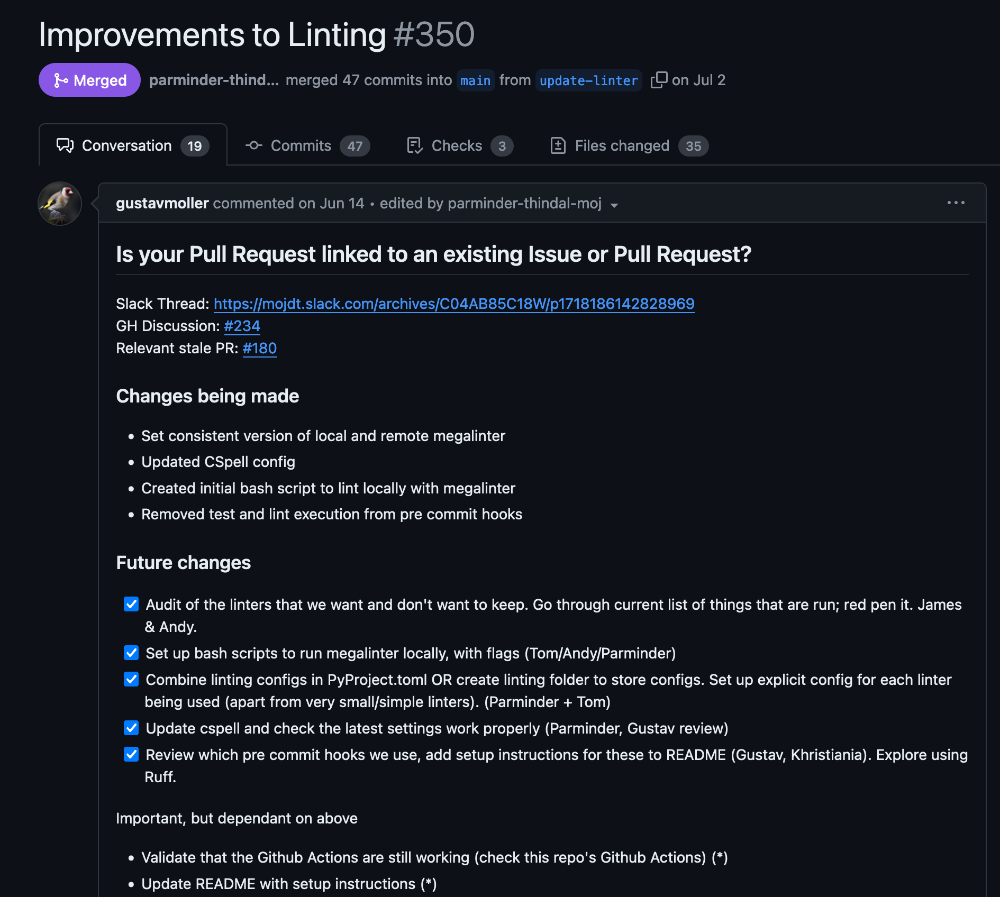
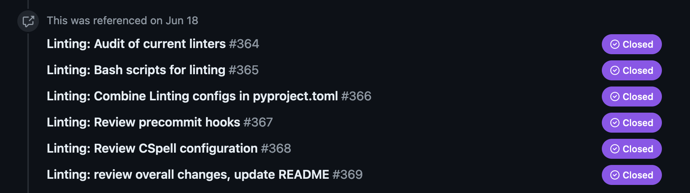

<!-- _header:  -->

## Gitflow vs Trunk Based Development

## Parminder & Tom H

### August 2024

---

## Why?"

-

---

## What? - Long Living Feature Branches (Git-flow)

- **Goal - Simplify release management and isolating feature development.**

- Feature based development ([Git-Flow workflow](https://www.atlassian.com/git/tutorials/comparing-workflows/gitflow-workflow))

- Developers create separate, long lived branches for individual features.

- Depending on complexity, feature branches can be active for days, weeks or months.

- Once the feature is complete and thoroughly tested, it can be merged back into the main branch.

---

## Gitflow Diagram

---

## Benefits of Git-flow

- Isolation of work:
  - Features are developed independently, reducing the risk of conflicts.

- Controlled Integration:
  - Code is reviewed and tested before merging.

- Supports Complex Projects:
  - Easier to manage large, multi-feature projects.

- Flexibility:
  -  Different branching strategies can be adapted to team needs.

---

## Disadvantages of Git-flow

- Complexity
  - Managing multiple branches can become complicated.

- Long Living Branches
  - Feature branches can diverge significantly, leading to merge conflicts.

- More Overhead.
  - Time consuming to review PR's and testing.

---

## What is Trunk Based Development?

- **Goal** - perform small incremental updates to minimize merge conflicts, and streamline the dev pipeline.

- Developers collaborate frequently on a single shared branch: "**trunk**" or "**main**".

- Frequent commits to the trunk, often multiple times a day.

- Short-lived branches are allowed, but are merged back to the **main** branch quickly.

---

## Trunk Based Development Diagram

---

## Benefits of Trunk Based Development

- Continuous Integration (CI)
  - Easier to integrate changes continuously.
  - Promotes frequent and smaller releases.
- Reduced marge conflicts
  - Less branching means fewer conflicts to resolve and less code to review.
- Faster feedback loops.
  - Immediate feedback on changes.
- Avoids clashes with other features in development.
  

---

## Disadvantages of Trunk Based Development

- Requires Discipline
  - Developers must commit to working code frequently.

- Risk of Breaking Changes
  - Changes committed to the trunk can affect all devs.

- Not ideal for Large Teams
  - Scaling can be challenging in large and distributed teams.

---

---

## Splink - CASE Study

Some interesting text

---

## Splink - CASE Study

Some interesting text

---

## create-a-pipeline - Linting 

- [PR - #350](https://github.com/moj-analytical-services/airflow-create-a-pipeline/pull/350)

- Refactor all of our linting tools.

- Everyone was on different components, and it was a major change on how we approached linting in the codebase.

- Used long living branches to manage each componential change.

---

## 

---

##  Linting

---

## Best Practices

- TBD
  - Commit often with small incremental changes
  - Use feature toggles to manage incomplete features

- Feature-Based
  - Keep branches short-lived to minimize divergence.
  - Ensure thorough code reviews and testing before merging.
  - Regularly rebase feature branches on the main branch to reduce conflicts.

---

## Other Best Practices

- Pair experienced developers with those new to a codebase.
- Communication, Communication, Communication

---

## Strategies from the wild:

- 

- 

---

## Questions?

- What have people done before which has been successful?
- What should be considered a long living branch? (*a few days, weeks? etc.*)
  How long is too long? (*Month? Year?*)
- Other strategies for managing long living branches.

---

## The End

Thanks!

---

## References
        
- [Git Branching Strategies vs Trunk Based Development - Launch Darkly BLOG](https://launchdarkly.com/blog/git-branching-strategies-vs-trunk-based-development/)
    
- [Git Branching Strategies - Medium](https://medium.com/@sreekanth.thummala/choosing-the-right-git-branching-strategy-a-comparative-analysis-f5e635443423)

- [Git Workflow - Atlassian](https://www.atlassian.com/git/tutorials/comparing-workflows/gitflow-workflow)

- [Trunk-Based Development - Atlassian](https://www.atlassian.com/continuous-delivery/continuous-integration/trunk-based-development)