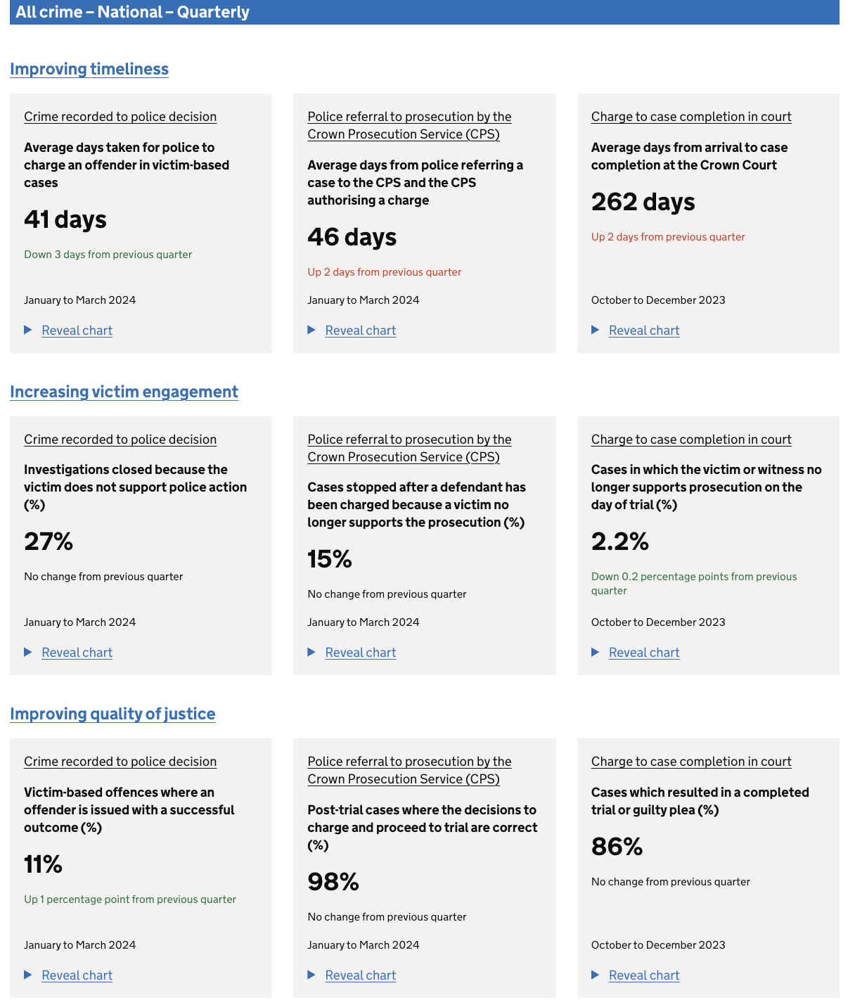

<!-- _header:  -->

## Building a transaction data lake  using<br/> [Amazon Athena, Apache Iceberg and dbt](https://moj-analytical-services.github.io/dmet-cfe/iceberg_athena_dbt)

<br/>

### Dr Soumaya Mauthoor

September 2024

---
<style scoped>
section {
  justify-content: flex-end;
}
</style>


Published in 2022 under the Johnson Conservative government

<!-- 
https://intranet.justice.gov.uk/blog/becoming-a-truly-data-led-justice-system/

Our data strategy:

We will improve justice outcomes through data driven insight and innovation.
We will ensure data meets user needs.
We will build a data culture to value data as a strategic asset.
-->

---
## MoJ Analytical Platform

</br>




--- 

<style scoped>
p { text-align: center; }
</style>

## Previous ELT Architecture


---

<style scoped>
p, h5 { 
  text-align: center; 
}
</style>

## Modern Table Formats

<!-- Provide a table-like abstraction on top of native file formats like Parquet by storing additional metadata. -->


##### **Iceberg** was the obvious choice for our usecase because of enhanced Athena support


---

<style scoped>
li { 
  font-size: 25px; 
}
</style>


## Glue PySpark vs Athena Curation Benchmarking


**Criteria**
1. Cost
2. Complexity
3. Run Time

**Dataset**

TPCDS stores_sales

- scale: 100 (~10GB)
- scale: 3000 (~400GB)

---
## Bulk Insert

<br/>

```
CREATE TABLE target_table
AS SELECT * FROM source_table
```
<br/>

- Athena is cheaper <=3TB scale
- Glue PySpark is faster at the 3TB scale


---
## SCD2 Merge

Update 0.1% rows 

```
MERGE INTO target_table
USING source_query
ON search_condition
WHEN MATCHED THEN UPDATE []
WHEN NOT MATCHED THEN INSERT []
```
<br/>

- Athena is cheaper and faster
- Glue PySpark runs out of memory at the 3TB scale


---

<style scoped>
p { 
  text-align: center; 
}
</style>

## Full Load Blue-Green Deployment


---

<style scoped>
p { 
  text-align: center; 
}
</style>

## Incremental Blue-Green Deployment


---

## Outcomes


- Reduced query costs by 99%

- Reduced query time by 50-75%
- Enabled daily refresh cycle
- Stabilised data pipeline
- Ensured data quality
- Streamlined technology stack
- Facilitated phased development

---

<!-- _class: title -->
<style scoped>
p { 
  font-size: 20px; 
}
</style>

# Questions?

<br/>
<br/>
<br/>
<br/>

These slides were created using 

