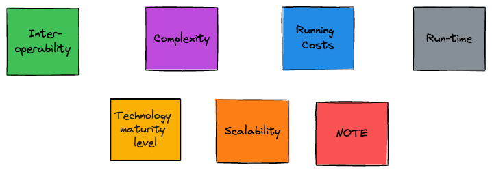
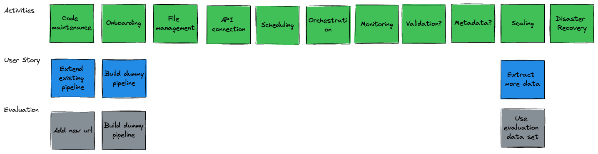

<!-- _header:  -->

# Evaluation Template

## Centre for Excellence

##### July 2024 

---

##  Why follow a Template? 

- Ensures all stakeholders are identified and informed

- Future-proof the solution

- Work around domain barriers

- Minimise duplication

- Speed up development

- Due diligence

---

## Does  / API Data Extraction need an Evaluation?

- Cross-cutting need for extracting data from APIs (as opposed to niche)

- APIs are evolving ([REST vs GraphQL](https://aws.amazon.com/compare/the-difference-between-graphql-and-rest/))

- Multiple stakeholders involved (allow analysts to extract data from APIs?)

- Need to integrate with existing tech stack

- Alternatives are available e.g. [Meltano](https://meltano.com/)

- dltHub is very Recent ([2022](https://github.com/dlt-hub/dlt/graphs/contributors))

- Do we need to consider data extraction in general?

---

## Proposed Approach

Based on the 2023 [Iceberg Evaluation](https://miro.com/app/board/uXjVMNUs7Pg=/)  

1. Set up cross-domain working group
1. Identify Personas / Users
1. Identify & Prioritise Evaluation Criteria
1. Create customised User Story Map
1. Get Feedback and Iterate?
1. Start Evaluation
1. Iterate on User Story Map?
1. Publish results and next steps

---

## Personas / Users

---

## Evaluation Criteria

---

## Data Engineer Story Mapping

---

